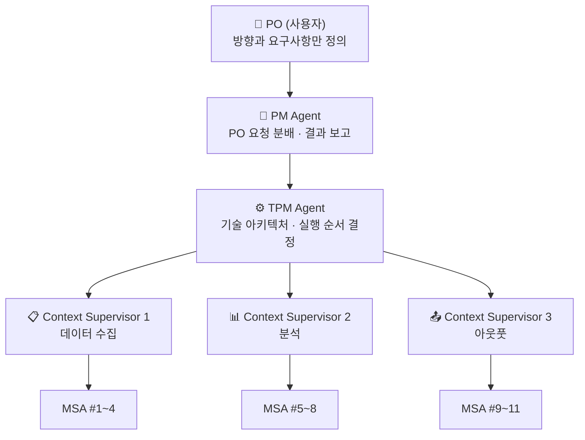
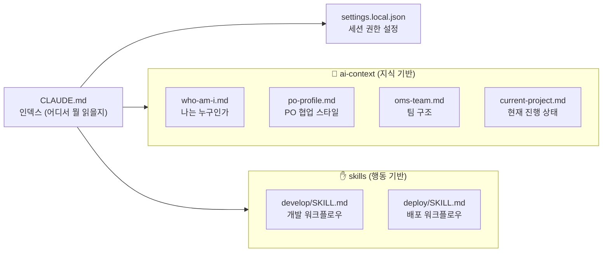
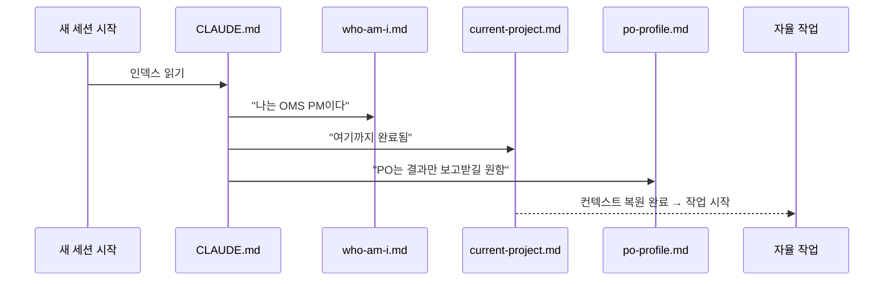

# Claude Agent Orchestration

> Claude CLI를 활용한 역할 기반 AI 에이전트 오케스트레이션 — OMS(Orchestrated Multi-agent System) 팀 구조와 Memento 패턴 기반 AI Context 설계

[](https://opensource.org/licenses/MIT)

---

## 핵심 아이디어: 영화 메멘토 패턴

> "잠에서 깨어났을 때 '나는 누구인가?'를 스스로 파악할 수 있는 AI를 만든다."

영화 메멘토의 주인공은 새로운 기억을 형성하지 못한다. 그래서 문신과 폴라로이드로 자신의 정체성을 기록하고, 잠에서 깨어날 때마다 읽어 맥락을 복원한다.

AI 에이전트도 마찬가지다. 세션이 끊기면 모든 컨텍스트가 사라진다. 이 프로젝트는 **AI가 스스로 역할, 팀 구조, 진행 상태를 복원할 수 있는 Context 설계 시스템**을 구현한다.

---

## OMS 팀 구조 (16-Agent)

실제 대형 개발 조직을 AI 에이전트로 모델링:



| 역할 | 책임 |
|------|------|
| PO | 방향과 요구사항만 정의 |
| PM | PO 요청 분배, 결과만 보고 |
| TPM | 기술 아키텍처 및 실행 순서 결정 |
| Context Supervisor | 파이프라인 내 컨텍스트 연속성 유지 |
| MSA Agent x11 | 단일 책임 — 하나의 에이전트는 하나의 일만 수행 |

---

## AI Context 설계: 지식 vs 행동 분리



| 구분 | ai-context | skills |
|------|-----------|--------|
| 역할 | "무엇을 알고 있는가" | "어떻게 행동하는가" |
| 로딩 | 세션 시작 시 명시적 로드 | 트리거 시 동적 로드 |
| 토큰 | 사전 계산 가능 | 실행 전 불확실 |

> **핵심 원칙**: 구조를 잡는 것은 개발자의 몫. 내용을 채우는 것은 AI 스스로.

---

## Memento 복원 시퀀스



---

## 에이전트 모드 (3-mode)

세션 시작 시 자동 모드 선택 프롬프트:

```
1. 채용 담당자 모드 — FAANG 기준 이력서 냉철 평가
2. 이력서 첨삭가 모드 — Next.js 이력서 사이트 직접 수정
3. AI 프로젝트 기획자 모드 — 포트폴리오 프로젝트 기획
```

별도 코드·서버 없이 **CLAUDE.md 프롬프트 엔지니어링만으로** 구현.

---

## 설치

```bash
git clone https://github.com/forexms78/claude-agent-orchestration.git
cat .claude/CLAUDE.md >> ~/.claude/CLAUDE.md
claude
```

---

## 관련 프로젝트

- [Whalyx](https://github.com/forexms78/whalyx) — OMS 에이전트 오케스트레이션 실전 적용 · 기관 투자자 자금 흐름 추적 플랫폼

---

## License

MIT
