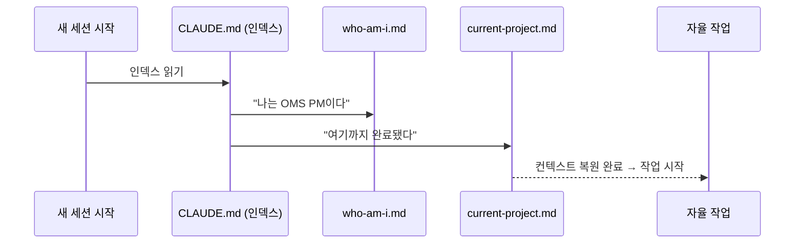
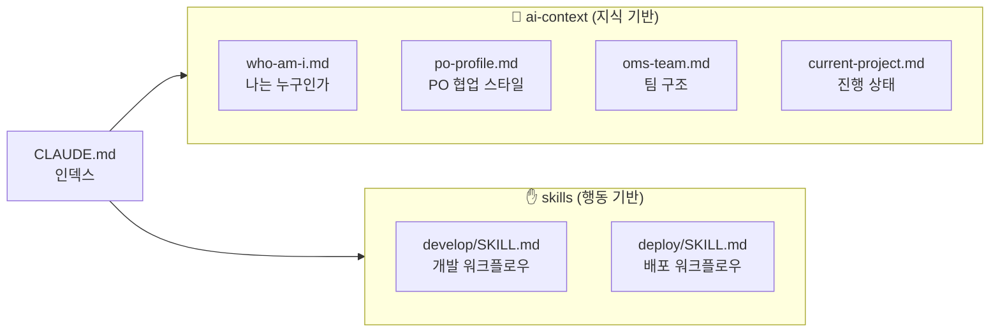
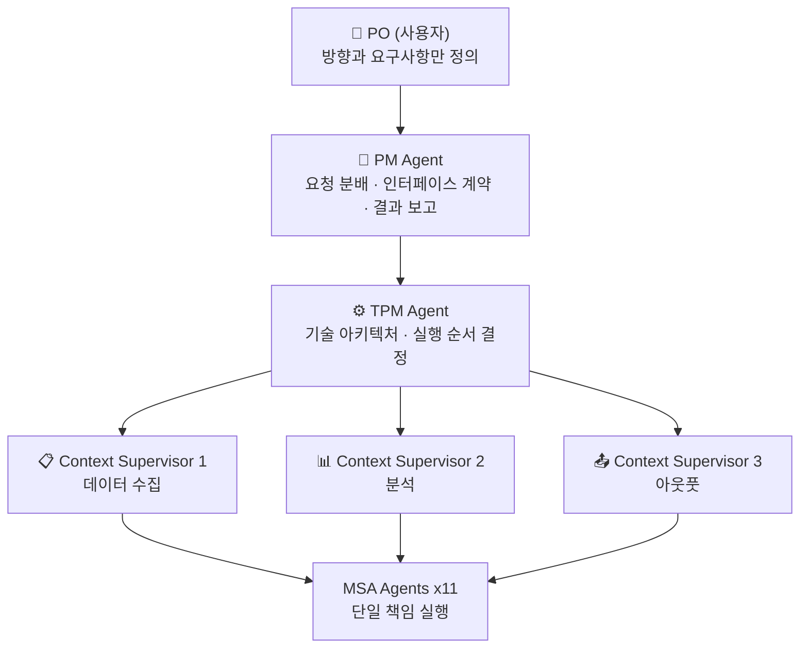

# Claude Agent Orchestration

> Claude CLI를 활용한 역할 기반 AI 에이전트 오케스트레이션 시스템

---

AI 에이전트와 함께 프로젝트를 진행하다 보면 반복되는 문제가 있다. 세션이 끊기면 모든 컨텍스트가 사라진다. 다음 세션에서 "우리가 지금 무엇을 만들고 있었고, 어디까지 했고, 어떤 방식으로 협업하기로 했는지"를 처음부터 다시 설명해야 한다. 대화가 길어질수록 이 반복은 더 자주 일어난다.

영화 메멘토의 주인공이 떠올랐다. 그는 새로운 기억을 형성하지 못한다. 그래서 문신과 폴라로이드에 자신의 정체성을 기록하고, 잠에서 깨어날 때마다 읽어 맥락을 복원한다. AI도 같은 방식으로 동작하면 어떨까.

---

## 무엇을 설계했는가

AI가 세션을 시작할 때 스스로 "나는 누구인가, 이 팀은 어떻게 움직이는가, 지금 무엇을 만들고 있는가"를 복원할 수 있도록 컨텍스트 구조를 설계했다. 개발자가 구조를 잡고, AI가 내용을 채운다.



핵심은 **지식(ai-context)과 행동(skills)을 분리**하는 것이다. 지식은 "무엇을 알고 있는가"이고, 행동은 "어떻게 실행하는가"다. 두 가지를 섞으면 컨텍스트가 비대해지고 토큰이 낭비된다. 분리하면 필요한 것만 그때그때 로드할 수 있다.



세션이 시작되면 CLAUDE.md가 먼저 로드된다. 이 파일은 "어디서 무엇을 읽어라"를 지시하는 인덱스다. AI는 이 인덱스를 따라 자신의 역할, 팀 구조, 현재 프로젝트 상태를 순서대로 복원한다. PO가 새 요청을 던지면 에이전트는 컨텍스트를 이미 갖춘 상태에서 바로 작업에 들어간다.

---

## 팀 구조

에이전트 시스템은 실제 개발 조직 구조를 모델로 설계했다. PO는 방향만 제시하고, PM이 요구사항을 분해해 각 에이전트에게 위임한다. 에이전트는 하나의 역할만 수행한다.



PM은 PO에게 기술적 질문을 하지 않는다. 불확실한 것은 팀 내부에서 결정하고, PO에게는 결과만 보고한다. 이 원칙 하나가 실제 협업의 질을 크게 바꾼다.

---

## 실제 사용 방식

별도 서버나 코드 없이 CLAUDE.md 프롬프트 엔지니어링만으로 동작한다. 세션 시작 시 모드를 선택하면 AI가 해당 페르소나로 전환된다.

```
1. 채용 담당자 모드 — FAANG 기준 이력서 냉철 평가
2. 이력서 첨삭가 모드 — Next.js 이력서 사이트 직접 수정
3. AI 프로젝트 기획자 모드 — 포트폴리오 프로젝트 기획
```

이 시스템 자체가 [Whalyx](https://github.com/forexms78/war-investment-agent) 개발에 실제로 적용됐다. PM + Backend Dev + Frontend Dev 3-Agent가 API 인터페이스 계약을 먼저 정의하고 백엔드와 프론트를 병렬로 개발하는 방식으로 단일 세션 내 기획~배포를 완성했다.

---

## 설치

```bash
git clone https://github.com/forexms78/claude-agent-orchestration.git
cat .claude/CLAUDE.md >> ~/.claude/CLAUDE.md
claude
```

---

MIT License
