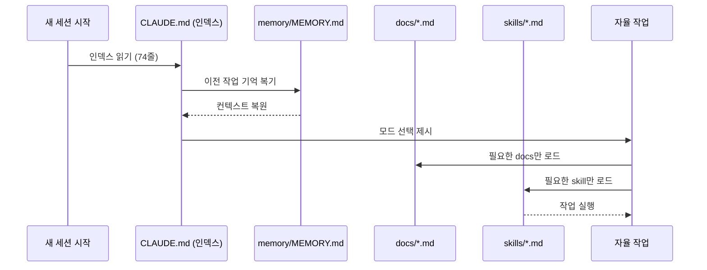
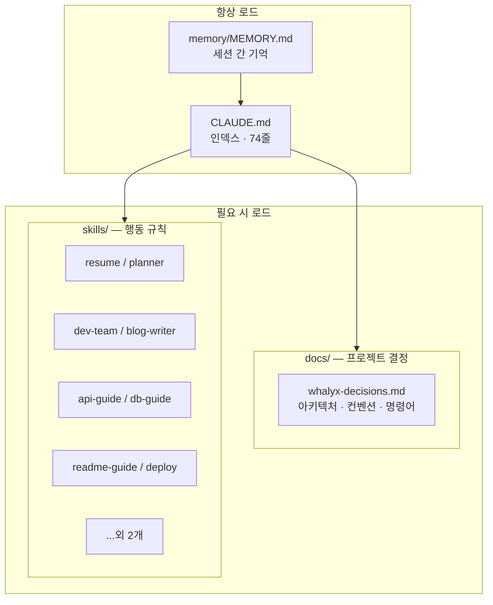
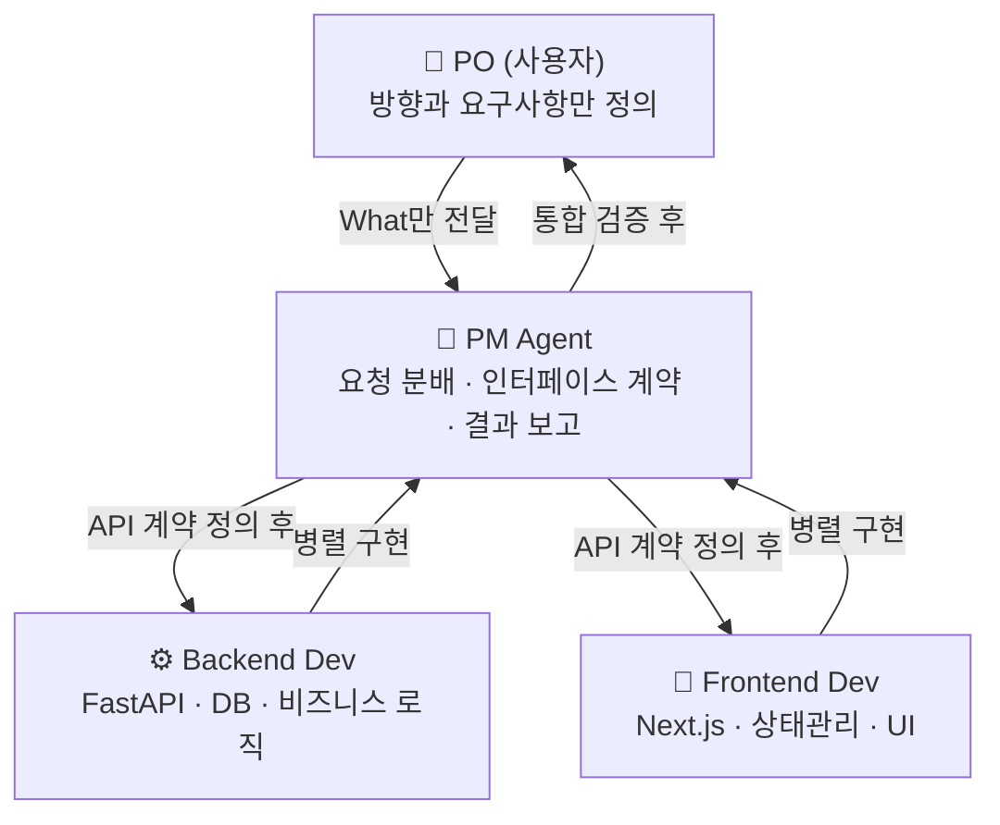

# Claude Agent Orchestration

> Claude CLI를 활용한 역할 기반 AI 에이전트 오케스트레이션 시스템

---

AI 에이전트와 함께 프로젝트를 진행하다 보면 반복되는 문제가 있다. 세션이 끊기면 모든 컨텍스트가 사라진다. 다음 세션에서 "우리가 지금 무엇을 만들고 있었고, 어디까지 했고, 어떤 방식으로 협업하기로 했는지"를 처음부터 다시 설명해야 한다. 대화가 길어질수록 이 반복은 더 자주 일어난다.

영화 메멘토의 주인공이 떠올랐다. 그는 새로운 기억을 형성하지 못한다. 그래서 문신과 폴라로이드에 자신의 정체성을 기록하고, 잠에서 깨어날 때마다 읽어 맥락을 복원한다. AI도 같은 방식으로 동작하면 어떨까.

---

## 무엇을 설계했는가

AI가 세션을 시작할 때 스스로 "나는 누구인가, 이 팀은 어떻게 움직이는가, 지금 무엇을 만들고 있는가"를 복원할 수 있도록 컨텍스트 구조를 설계했다. 개발자가 구조를 잡고, AI가 내용을 채운다.



처음엔 CLAUDE.md 하나에 모든 것을 담았다. 역할 정의, 모드별 규칙, 프로젝트 컨텍스트, 코딩 컨벤션까지. 331줄이 됐을 때 문제가 명확해졌다. 매 세션마다 관련 없는 내용까지 전부 토큰으로 소모됐다. "블로그 써줘" 한 마디에 FastAPI 컨벤션까지 로드되는 구조였다.

해결책은 **CLAUDE.md를 인덱스로만 쓰는 것**이었다.

---

## 분산 메모리 구조

지식과 행동을 레이어로 분리한다. 각 레이어는 독립적으로 유지보수되고, 필요할 때만 로드된다.



CLAUDE.md는 "어디서 무엇을 찾는가"만 담는다. 상세 내용은 절대 직접 작성하지 않는다. 새 규칙이 생기면 `docs/` 또는 `skills/`에 파일을 만들고 인덱스에 한 줄만 추가한다. 331줄짜리 파일이 74줄로 줄어드는 동안 버려진 내용은 없다. 전부 적재적소로 이동했다.

---

## 팀 구조

에이전트 시스템은 실제 개발 조직 구조를 모델로 설계했다. PO는 방향만 제시하고, PM이 요구사항을 분해해 각 에이전트에게 위임한다. 에이전트는 하나의 역할만 수행한다.



PM은 PO에게 기술적 질문을 하지 않는다. 불확실한 것은 팀 내부에서 결정하고, PO에게는 결과만 보고한다. API 인터페이스 계약을 먼저 정의하면 백엔드와 프론트엔드가 같은 응답 안에서 병렬로 구현된다.

---

## Skills 시스템

모드와 기술 영역별로 행동 규칙을 스킬 파일로 분리했다. "블로그 써줘"가 들어오면 `blog-writer` 스킬만 로드된다. FastAPI 컨벤션은 그 순간 컨텍스트에 없다.

| Skill | 트리거 |
|-------|--------|
| `resume` | 이력서 평가·첨삭·자소서 작성 |
| `planner` | AI 포트폴리오 프로젝트 기획 |
| `dev-team` | PM+Backend+Frontend 팀 개발 |
| `blog-writer` | 티스토리 HTML 포스트 생성 |
| `factcheck` | 논문·공식 통계 기반 분석 |
| `develop` | 기능 구현·버그 수정 워크플로우 |
| `deploy` | Railway + Vercel 배포 |
| `api-guide` | FastAPI 엔드포인트 설계 규칙 |
| `db-guide` | SQLAlchemy + Supabase 쿼리 규칙 |
| `readme-guide` | README 스토리텔링·Mermaid·버전 히스토리 |

스킬은 `SKILL.md` 파일 하나로 구성된다. 트리거 조건, 페르소나, 체크리스트, 출력 형식을 담는다. Claude Code의 `Skill` 도구가 해당 파일을 읽어 그 순간 필요한 컨텍스트만 주입한다.

---

## 토큰 절약 원칙

컨텍스트를 아끼는 것도 시스템의 일부다. 6가지 규칙이 항상 적용된다.

1. 이미 읽은 파일은 다시 읽지 않는다
2. 아는 정보를 확인용으로 재조회하지 않는다
3. 독립 작업은 병렬 실행한다
4. 20줄 이상 탐색은 서브에이전트에 위임한다
5. 사용자가 설명한 내용을 반복하지 않는다
6. 컨텍스트 60% 도달 시 `/compact` 실행을 안내한다

---

## 실제 사용 방식

별도 서버나 코드 없이 CLAUDE.md 프롬프트 엔지니어링만으로 동작한다. 세션 시작 시 모드를 선택하면 AI가 해당 스킬을 로드하고 페르소나로 전환된다.

```
1. 이력서 평가 & 첨삭 — FAANG 기준 평가 + Next.js 이력서 직접 수정
2. AI 프로젝트 기획자 — 포트폴리오 프로젝트 함께 기획
3. 시니어 개발자 팀  — PM + Backend + Frontend 병렬 개발
4. 기술 블로그 작가  — 티스토리 HTML 포스트 생성
5. 팩트체크          — 논문·공식 통계만으로 답변
```

이 시스템 자체가 [Whalyx](https://github.com/forexms78/war-investment-agent) 개발에 실제로 적용됐다. PM + Backend Dev + Frontend Dev 3-Agent가 API 인터페이스 계약을 먼저 정의하고 백엔드와 프론트를 병렬로 개발하는 방식으로 단일 세션 내 기획~배포를 완성했다.

---

## 설치

```bash
git clone https://github.com/forexms78/claude-agent-orchestration.git
cat .claude/CLAUDE.md >> ~/.claude/CLAUDE.md
claude
```

---

## 버전 히스토리

| 버전 | 날짜 | 변경 내용 |
|------|------|----------|
| v1.4 | 2026-04-07 | 분산 메모리 구조 도입 — CLAUDE.md 인덱스화(74줄), docs/·skills/ 10개 분리, 토큰 절약 6원칙 |
| v1.3 | 2026-03-26 | README 스토리텔링 방식 전면 재작성, Mermaid 다이어그램 추가 |
| v1.2 | 2026-03-24 | OMS 팀 구조 정의, 모드 시스템 도입 |
| v1.1 | 2026-03-20 | Memento 패턴 기반 컨텍스트 복원 구조 설계 |
| v1.0 | 2026-03-01 | 최초 릴리즈 |

---

MIT License
